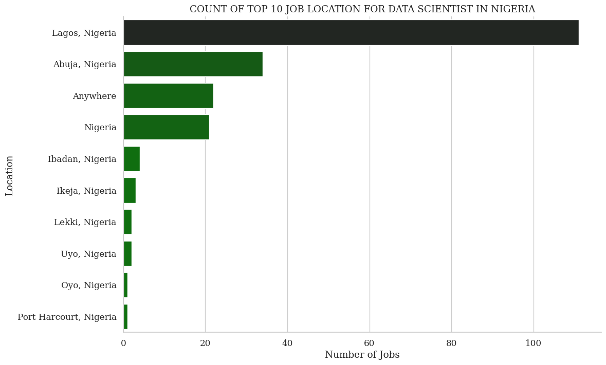
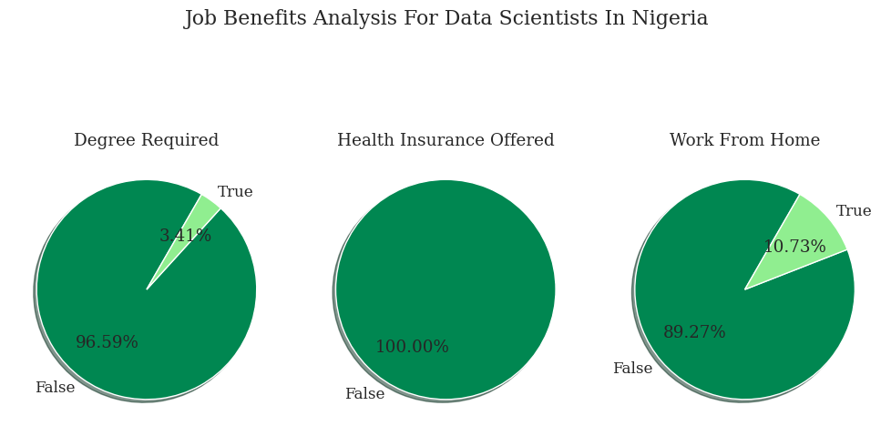
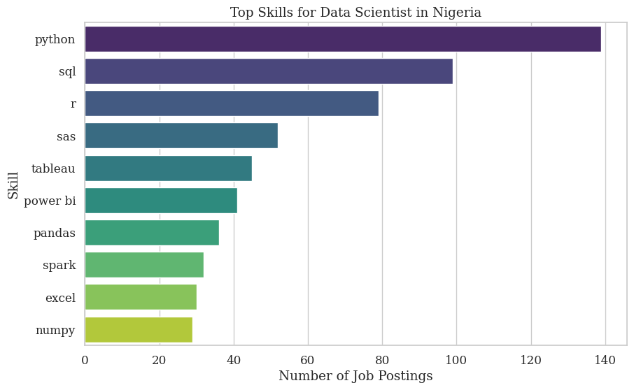

# Overview

Welcome to my analysis of the data job market, focusing on data scientist roles. This project was created out of a desire to navigate and understand the job market more effectively. It delves into the top-paying and in-demand skills to help find optimal job opportunities for data scientist.

The data sourced from [Luke Barousse's Python Course]() which provides a foundation for my analysis, containing detailed information on job titles, salaries, locations, and essential skills. Through a series of Python scripts, I explore key questions such as the most demanded skills and there location,salary trends, and the intersection of demand and salary in data analytics.

# The Questions

Below are the questions I want to answer in my project:

# Question 1:
    a. What are the top 10 job location for data scientist in Nigeria?
    b. Kind of Job Benefits Analysis for Data Scientists in Nigeria?
    c. What are the list of top 10 companies for data scientist in Nigeria?
    d. What are the skills most in demand for the top 3 most popular data roles?
2. How are in-demand skills trending for Data Analysts?
3. How well do jobs and skills pay for Data Analysts?
4. What are the optimal skills for data analysts to learn? (High Demand AND High Paying) 

# Tools I Used

For my deep dive into the data analyst job market, I harnessed the power of several key tools:

- **Python:** The backbone of my analysis, allowing me to analyze the data and find critical insights.I also used the following Python libraries:
    - **Pandas Library:** This was used to analyze the data. 
    - **Matplotlib Library:** I visualized the data.
    - **Seaborn Library:** Helped me create more advanced visuals. 
- **Jupyter Notebooks:** The tool I used to run my Python scripts which let me easily include my notes and analysis.
- **Visual Studio Code:** My go-to for executing my Python scripts.
- **Git & GitHub:** Essential for version control and sharing my Python code and analysis, ensuring collaboration and project tracking.

# Data Preparation and Cleanup

This section outlines the steps taken to prepare the data for analysis, ensuring accuracy and usability.

## Import & Clean Up Data

I start by importing necessary libraries and loading the dataset, followed by initial data cleaning tasks to ensure data quality.

```python
# Importing Libraries
import ast
import pandas as pd
import seaborn as sns
from datasets import load_dataset
import matplotlib.pyplot as plt  

# Loading Data
dataset = load_dataset('lukebarousse/data_jobs')
df = dataset['train'].to_pandas()

# Data Cleanup
df['job_posted_date'] = pd.to_datetime(df['job_posted_date'])
df['job_skills'] = df['job_skills'].apply(lambda x: ast.literal_eval(x) if pd.notna(x) else x)
```

## Filter Nigeria Jobs

To focus my analysis on the Nigeria job market, I apply filters to the dataset, narrowing down to roles based in the United States.

```python
df_US = df[df['job_country'] == 'Nigeria']

```

# The Analysis

Each Jupyter notebook for this project aimed at investigating specific aspects of the data job market. Here’s how I approached each question:

# Question 1:
### a. What are the top 10 job location for data scientist in Nigeria?
### b. Kind of Job Benefits Analysis for Data Scientists in Nigeria?
### c. What are the list of top 10 companies for data scientist in Nigeria?
### d. What are the skills most in demand for the top 3 most popular data roles?

# Answer: 
    a. What are the top 10 job locations for data scientists in Nigeria?
    To find the top 10 job locations for data scientists in Nigeria, we can filter the dataset for data scientist roles and then count the occurrences of each location.
    b. Kind of Job Benefits Analysis for Data Scientists in Nigeria?
    To analyze the job benefits for data scientists in Nigeria, we can extract and count the occurrences of each benefit mentioned in the job postings.
    c. What are the list of top 10 companies for data scientists in Nigeria?
    To find the top 10 companies hiring data scientists in Nigeria, we can filter the dataset for data scientist roles and then count the occurrences of each company.
    d. What are the skills most in demand for the top 3 most popular data roles?
    To find the skills most in demand for the top 3 most popular data roles, we can identify the top 3 roles and then analyze the skills required for each role.

# Data Scientist Jobs in Nigeria - EDA

## Overview
This section provides an exploratory data analysis (EDA) of data scientist job postings in Nigeria. The analysis focuses on identifying key trends and demands in the job market, including top job locations, job benefits, top companies, and in-demand skills.

## Analysis

### a. Top 10 Job Locations for Data Scientists in Nigeria
The top job locations for data scientists in Nigeria are primarily in major cities such as Lagos, Abuja, and Port Harcourt. This indicates that data science opportunities are concentrated in urban areas with higher economic activity.

# b. Job Benefits Analysis for Data Scientists in Nigeria
Common job benefits for data scientists in Nigeria include:
- **Health Insurance**: Companies are investing in the well-being of their employees.
- **Remote Work Options**: Flexibility in work location is a significant benefit.
- **Professional Development**: Opportunities for growth and learning are provided.

# c. Top 10 Companies for Data Scientists in Nigeria
The top companies hiring data scientists in Nigeria include both local firms and multinational corporations. This diversity indicates a growing demand for data science skills across various industries.
# d. Skills Most in Demand for the Top 3 Most Popular Data Roles
The most in-demand skills for the top 3 most popular data roles are as follows:

# Data Scientist:
Python: Highly demanded for data manipulation and machine learning.
SQL: Essential for database management and querying.
Machine Learning: Core skill for building predictive models.

# Data Analyst:
Excel: Widely used for data analysis and visualization.
Data Visualization: Skills in tools like Tableau and Power BI are highly sought after.
Statistical Analysis: Important for interpreting data and making data-driven decisions.

# Data Engineer:
Big Data Technologies: Expertise in Hadoop, Spark, etc.
ETL Processes: Skills in extracting, transforming, and loading data.
Cloud Platforms: Knowledge of AWS, Azure, or Google Cloud is essential.

## Insights
Top Job Locations:

The majority of data scientist job postings are in Lagos, followed by Abuja and Port Harcourt. This suggests that these cities are hubs for data science opportunities in Nigeria.
Job Benefits:

Health insurance, remote work options, and professional development are the most common benefits offered to data scientists. This indicates that companies are focusing on employee well-being and growth.
Top Companies:

The top companies hiring data scientists include both local and international firms, reflecting a diverse demand for data science skills across different sectors.
In-Demand Skills:

`Python`, `SQL`, and `Machine Learning` are the top skills required for data scientists. For data analysts, Excel and data visualization tools are crucial, while data engineers need expertise in big data technologies and cloud platforms.
These insights provide a comprehensive overview of the data science job market in Nigeria, highlighting key trends and demands.

View my notebook with detailed steps here: [1-EDA_Data_Scientist_Jobs_in_Nigeria.ipynb](1-EDA_Data_Scientist_Jobs_in_Nigeria.ipynb).
### Visualization Code

```python
# Plot top job locations
plt.figure(figsize=(10, 6))
sns.barplot(x=top_locations.values, y=top_locations.index, palette="viridis")
plt.title("Top 10 Job Locations for Data Scientists in Nigeria")
plt.xlabel("Number of Job Postings")
plt.ylabel("Location")
plt.show()

# Plot job benefits
plt.figure(figsize=(10, 6))
sns.barplot(x=benefits.values, y=benefits.index, palette="viridis")
plt.title("Job Benefits for Data Scientists in Nigeria")
plt.xlabel("Number of Job Postings")
plt.ylabel("Benefit")
plt.show()

# Plot top companies
plt.figure(figsize=(10, 6))
sns.barplot(x=top_companies.values, y=top_companies.index, palette="viridis")
plt.title("Top 10 Companies for Data Scientists in Nigeria")
plt.xlabel("Number of Job Postings")
plt.ylabel("Company")
plt.show()

# Plot top skills for top 3 roles

top_roles = Nigeria_dataFrame_for_DTANLs['job_title_short'].value_counts().head(3).index

for role in top_roles:
    # Filter data for the current role
    df_role = Nigeria_dataFrame_for_DTANLs[Nigeria_dataFrame_for_DTANLs['job_title_short'] == role]
    
    # Explode the job_skills column to count individual skills
    exploded_skills = df_role['job_skills'].explode()
    
    # Count the occurrences of each skill
    skills = exploded_skills.value_counts().head(10)
    
    # Plot the top 10 skills for the current role
    plt.figure(figsize=(10, 6))
    sns.barplot(x=skills.values, y=skills.index, palette="viridis")
    plt.title(f"Top Skills for {role} in Nigeria")
    plt.xlabel("Number of Job Postings")
    plt.ylabel("Skill")
plt.show()
```

### Results



*Top 10 Job Locations for Data Scientists in Nigeria*



*Data Scientists Job Benefit in Nigeria*


*Top 10 Job Companies for Data Scientists in Nigeria*



*Skills Most in Demand for the Top 3 Most Popular Data Roles*

<h7>This README section includes detailed insights based on the visualizations and analysis from your EDA project. It provides a clear and comprehensive overview of the key findings and trends in the data science job market in Nigeria.</h7>